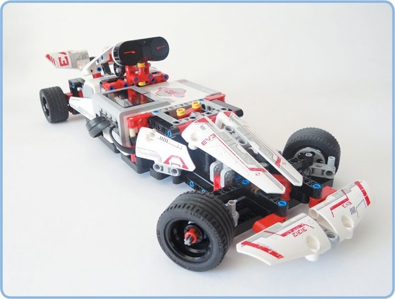
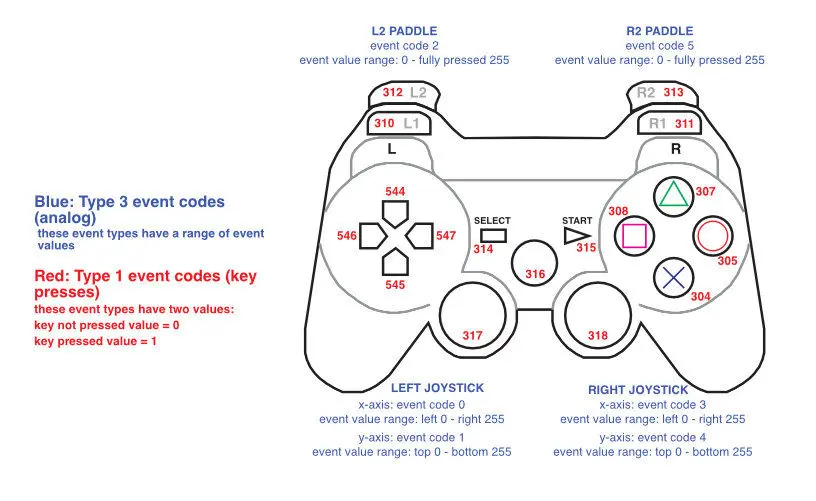

# PS3 Controller Controlled EV3 Car using ev3dev

This car uses an ev3 race car and a bluetooth connected ps3 controller.
The remote connection tutorial is here https://www.ev3dev.org/docs/tutorials/using-ps3-sixaxis/ 

And the robot design is here https://magbuhatrobotics.files.wordpress.com/2017/05/chapter-12.pdf

## The Code
Basically, this is a code utilizes a bluetooth connection with the controller and receives events via evdev's input device connection. The layout for the event codes is in this image.

The Car steers by moving the right sticks on the x axis and drives by moving the left stick up and down. You can turn precision mode of by holding R1 which turns the steering less. You can also lock the steering by holding L1.

The X button ends the program.

Note: I used the EV3 core set to make the car. You don't need to include any sensors for this project.